# FederatedLearningSimulation

Risultati degli esperimenti:

1. Risultati dell'esecuzione del codice di Federated Learning con 2 client che si suddividono equamente il dataset

n batch client 1:  234

n batch client 2:  235

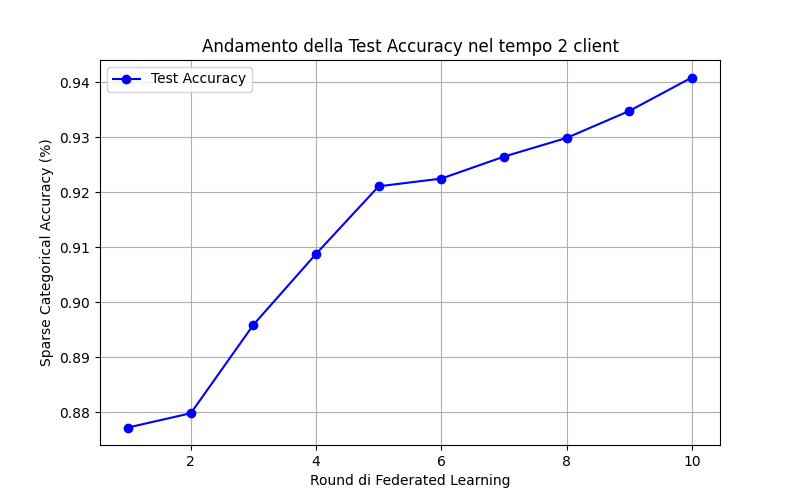

Da questo grafico si evince un andamento relativamente costante nella metrica di accuracy, che aumenta per ogni round.
Un significativo miglioramento dell'accuracy avvviene dal 2° al 5° round, mentre dal 5° al 10° round si evince un costante miglioramento ma con una curva meno pendente rispetto ai precenti round.
Nel complesso, dato il numero di client, e il numero di batch assegnati ad ogni client, permettono una fase di training efficace che si riflette poi nel modello globale.

2. Risultati dell'esecuzione del codice di Federated Learning con 5 client che si suddividono equamente il dataset

n_client:  5

client 0 num batch: 94

client 1 num batch: 94

client 2 num batch: 94

client 3 num batch: 94

client 4 num batch: 93

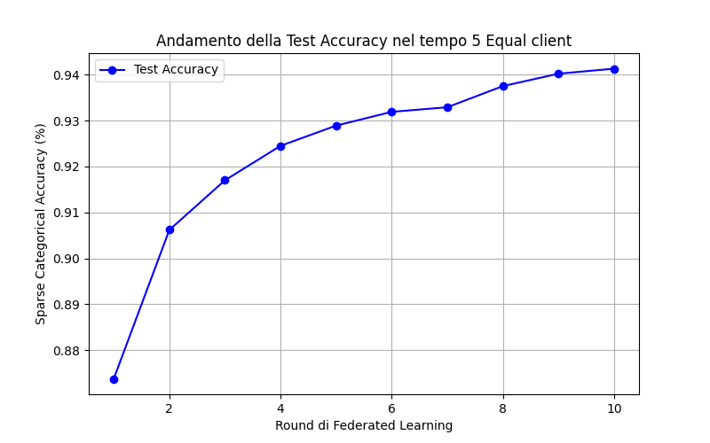

In questo esperimento si verifica un miglioramento dell'accuracy molto elevato per i primi due round, mentre per i successivi si verifica un costante, ma sempre più piccolo, miglioramento dell'accuracy che porta ad un risultato poco oltre al 94% come nell'esperimento precedente.
Si evince che con l'avanzare dei round l'accuracy aumenta sempre di meno rispetto al round precedente.

3. Risultati dell'esecuzione del codice di Federated Learning con 5 client che si suddividono randomicamente il dataset

n_client:  5

num_batch_train_elements:  469

client 0 num batch: 179

client 1 num batch: 86

client 2 num batch: 189

client 3 num batch: 3

client 4 num batch: 12

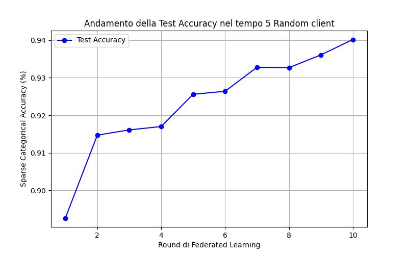

In questo esperimento invece si nota un andamento molto meno costante rispetto agli esperimenti precedenti, probablimente a causa del numero di batch assegnati in modo randomico ai client, portando alcuni di essi ad allenare quasi 200 batch mentre nel caso peggiore limitandosi al training di 3 batch. 
Questa suddivisione del dataset porta ad un risultato finale molto simile agli esperimenti precedenti, anche se con un andamento dell'accuracy, round per round, molto diverso rispetto ai precedenti, caratterizzato da picchi soprattutto per il 2°, 5°, 7° round, in termini di aumento dell'accuracy e gli altri round invece meno significativi (con però sempre un miglioramento anche se di poco dell'accuracy)

Di seguito riporto i grafici di 14 test con un numero di client che varia per ogni test:

  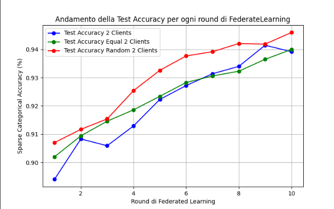
  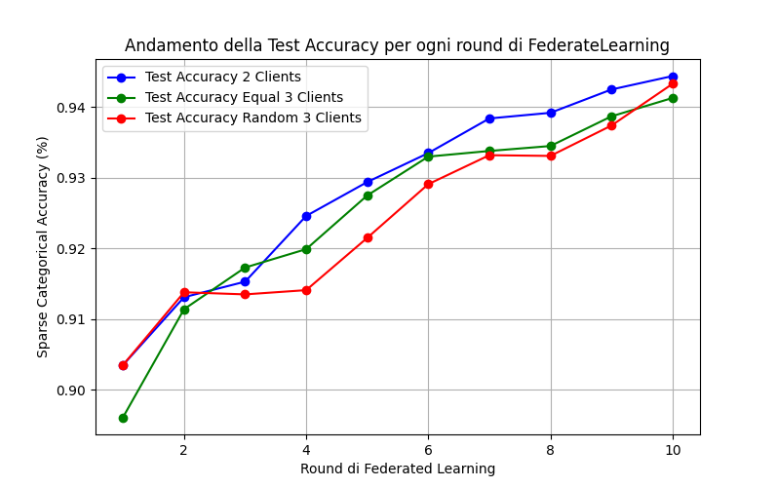
  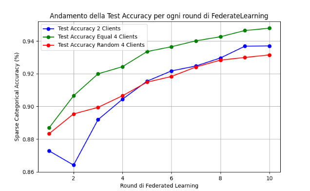
  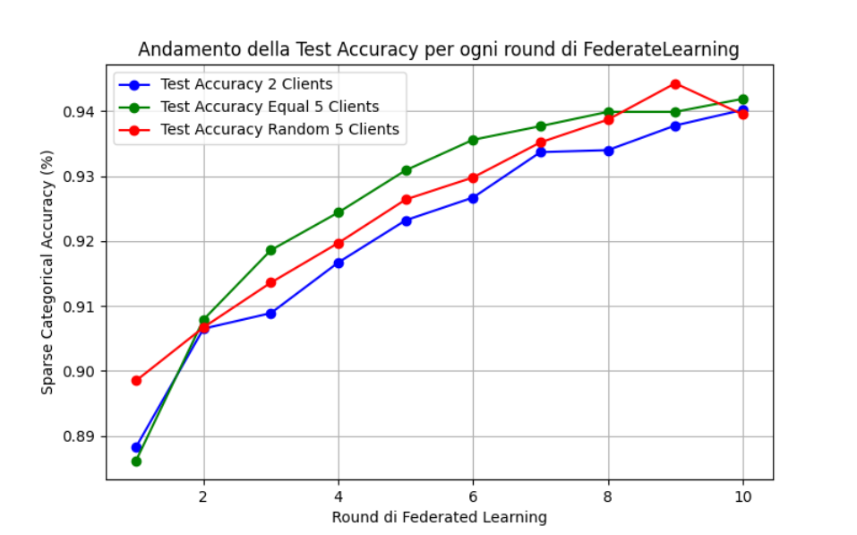
  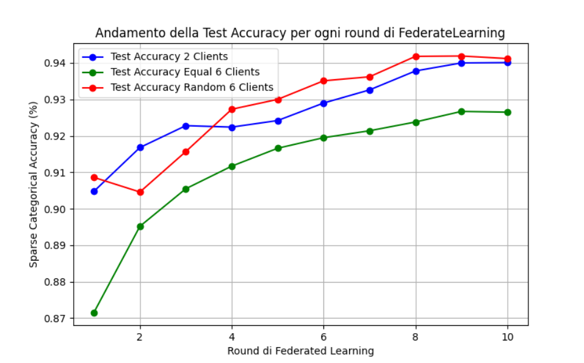
  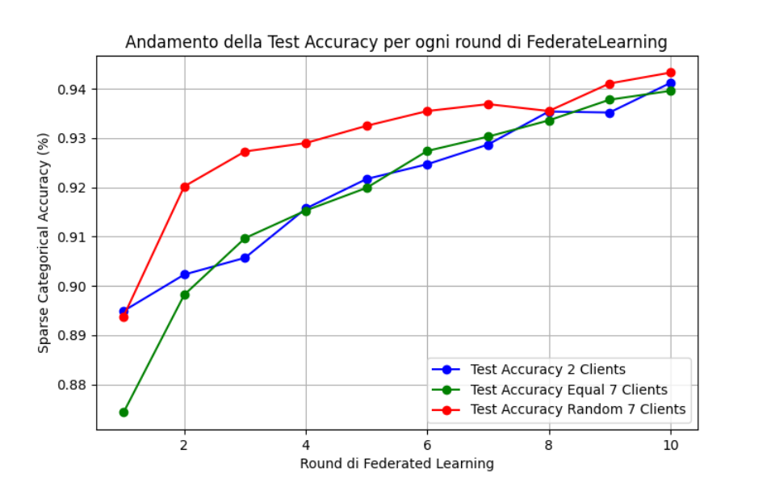
  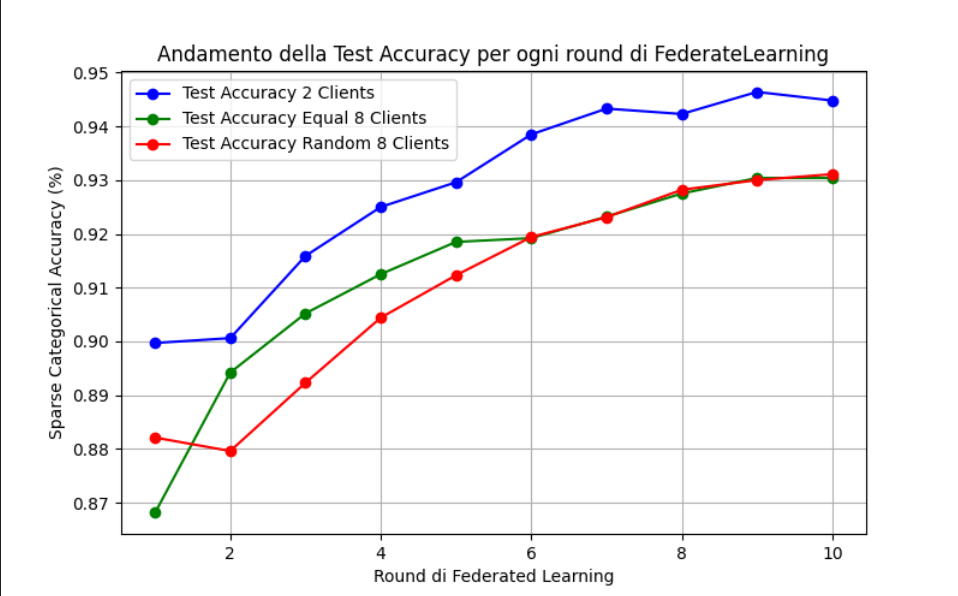
  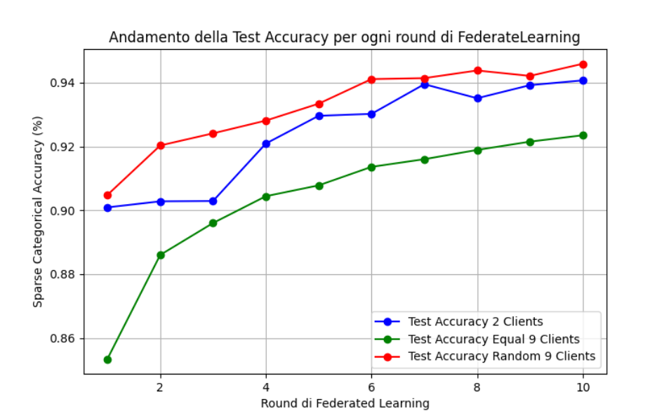
  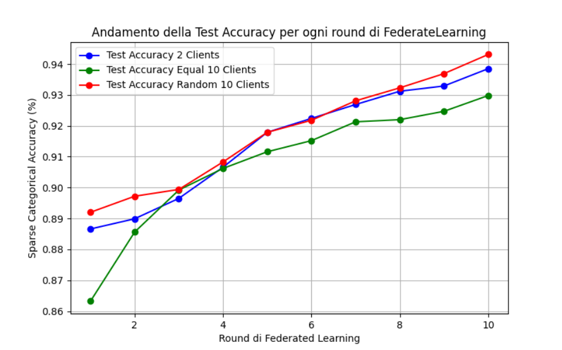
  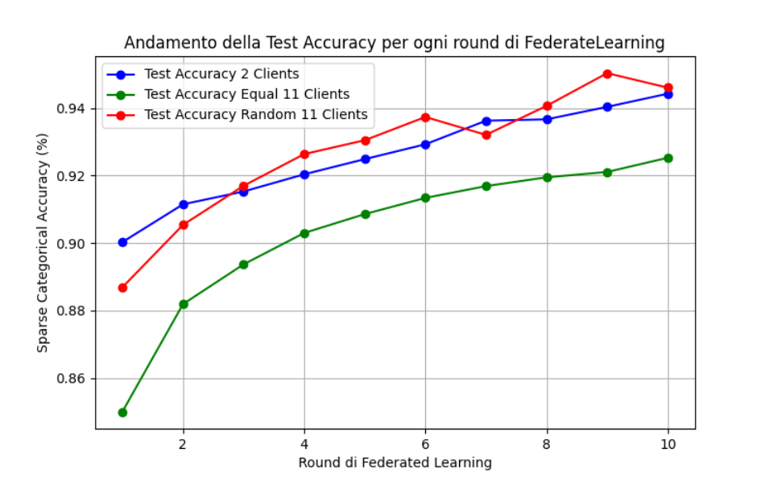
  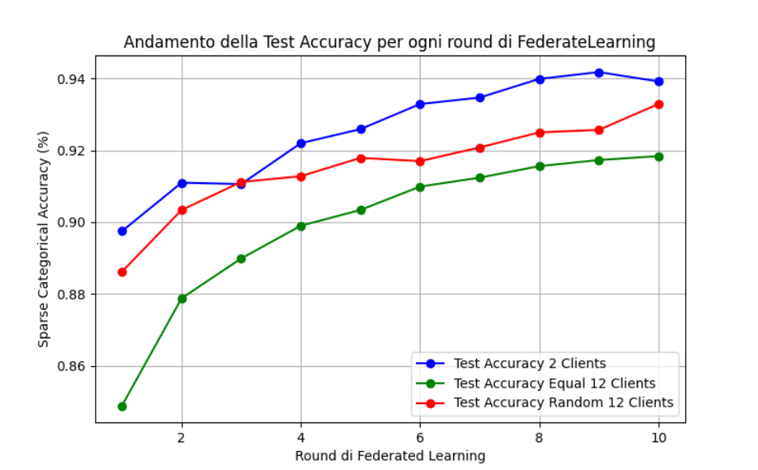
  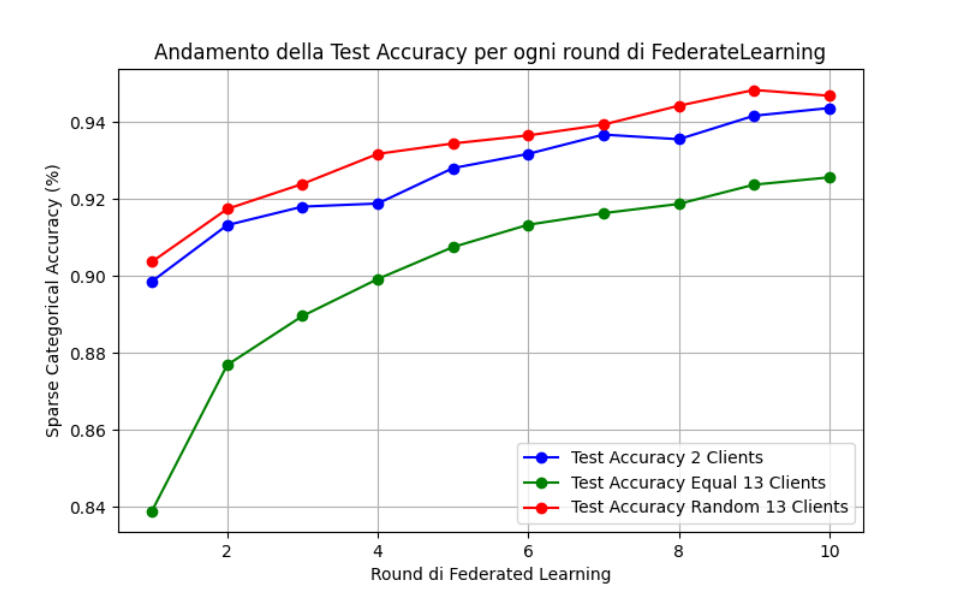
  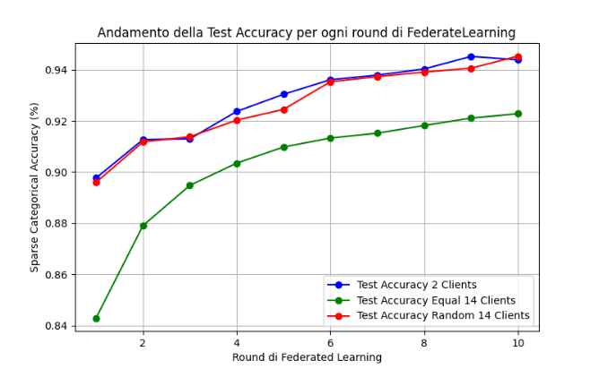
  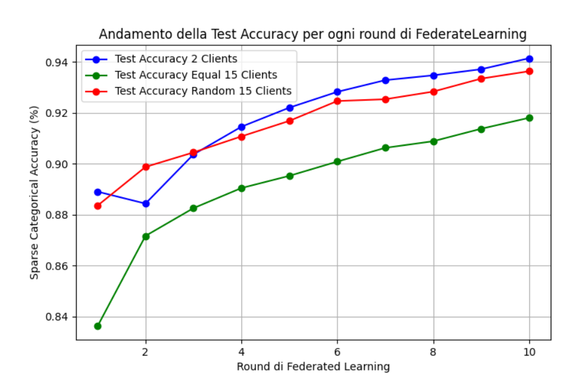

Dai grafici emerge che nell'apprendimento federato con pochi client i risultati sono molto simile e le curve di apprendimento sono più o meno costanti (ovviamente il test con 2 client resta sempre la curva più costante delle tre) e raggiungono alti tassi di accuratezza che si aggirano circa al 94%. Ciò che rende però interessanti questi test è che con l'aumentare del numero di client, per la seconda e terza versione, otteniamo risultati diversi. Nella seconda versione il numero di batch per client è equo tra tutti i client, e di conseguenza diminuisce sempre di più, all'aumentare del numero di client, mentre per la terza versione del codice di simulazione di Federated Learning, il Set di dati è suddiviso randomicamente tra i vari client (più realistico) il che porta ad avere client con un numero elevato di batch, come 200/300 batch sui 469 batch totali per alcuni, ed altri client con anche 1 solo batch.  Al netto di questa suddivisione come si nota soprattutto negli ultimi grafici, l'apprendimento del modello globale è più elevato quando sono presenti client con un elevato numero di batch, e di conseguenza la seconda versione di Federate Learning risulta come meno accurata rispetto alla terza, poichè con un numero elevato di client che implica un numero medio/basso di batch per ogni client, l'apprendimento del modello globale, e quindi l'accuratezza del modello è peggiore rispetto, all'apprendimento con anche un solo client con un numero elevato di batch, il che consente una fase di training migliore e di conseguenza permette un update al center model più preciso ed efficace, dato che ogni client contribuisce con al calcolo dei nuovi weights in base al numero di batch che tratta (media pesata).

Nei seguenti tre esperimenti, ho modificato i codici di Federated Learning con equal clients (dataset suddiviso equamente tra tutti i client, a tutti i client è assegnato lo stesso numero di batch, cioè se si considera un numero di batch totale pari a 469, di conseguenza un numero di batch assegnato ad ogni client pari a 47, che significa circa 6016 immagini per ogni client, dato che per batch si intende un gruppo di 128 elementi) e random clients (dataset suddiviso randomicamente tra tutti i client, numero casuale di batch assegnati ad ogni client, quindi un numero di immagini per client che varia più o meno da 18000 immagini assegnate ad un solo client, fino ad un singolo batch cioè solo 128 elementi), e testato, suddividendo il dataset tra 10 client, durante la fase di training diversi valori di participation rate: 0.1, 0.2, 0.5 e 1

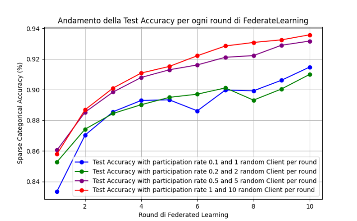

In questo esempio vengono mostrati i 4 andamenti dell'accuracy con i diversi tassi di participation rate, e con un dataset diviso equamente trai i vari client si nota un andamento più costante e più efficiente direttamente proporzionale al tasso di partecipation rate

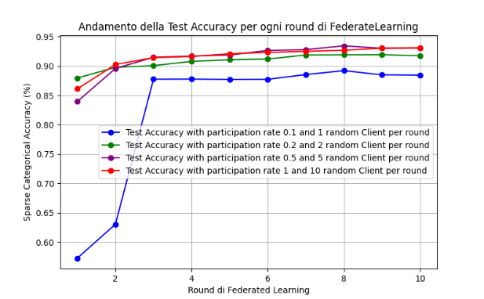
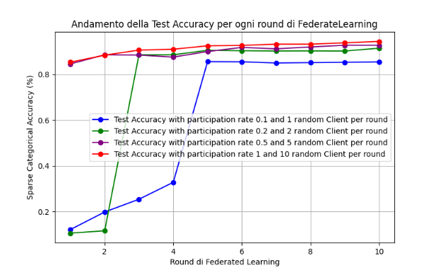

In questi esempi, a differenza del precedente il dataset è diviso randomicamente tra i vari client e infatti si nota un andamento randomico e meno lineare rispetto al primo esempio, questo è probabilmente dovuto al numero randomicità non solo dei client che partecipano durante ogni round ma anche della suddivisione del dataset, soprattutto per i round iniziali, mentre a lungo andare la accuracy si stabilizza e denota come nei casi con più elevato tasso di partecipation rate riflettono una percentuale più elevata di accuracy

Di seguito vengono mostrati tre esperimenti in cui il dataset viene suddiviso a seconda dei label degli elementi (non-IID partitioning), cioè ai client vengono assegnati gli elementi solo di alcune classi di tutto il dataset. Nel primo esempio vengono assegnati ai client tutte le classi del dataset, nel secondo esempio solo 5 classi randomiche del dataset e infine l'ultimo esperimento in cui viene assegnato ad ogni client solo una classe di elementi randomica tra le 10 disponibili (0, 1, 2, 3, 4, 5, 6, 7, 8, 9)

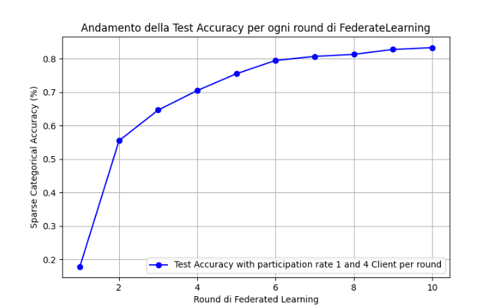
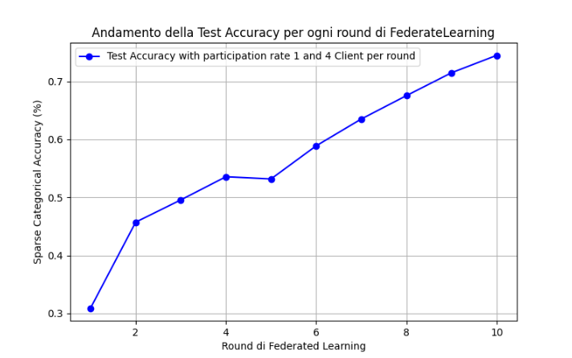
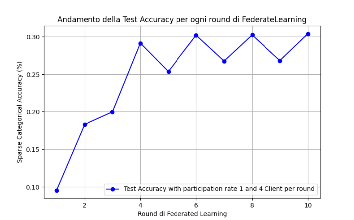
